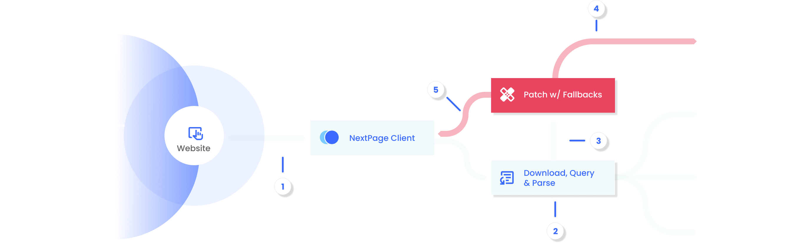

<p align="center">
  
</p>

---

 
[](https://nextpage.bypickering.com)
[](https://www.linkedin.com/in/romeo-pickering/)
[](https://github.com/theoromeo/NextPage-Client/blob/main/documentation/index.md)

NextPage is a protocol and interface that turns information dense webpages into dynamic objects that share the most important content and actions like signup forms directly to users, without the user needing to leave the page.

This is just a quick start guide. For the full documentation, visit the [NextPage Parser Repository](https://github.com/theoromeo/NextPage-Parser).

## Index
* [How NextPage Works (High-Level Overview)](#%EF%B8%8F--how-nextpage-works-high-level-overview)
    - [Defining NextPage-Enabled Webpages](#-defining-nextpage-enabled-webpages)
    - [Enabling The NextPage Client](#-enabling-the-nextpage-client)
    - [Querying The Webpage](#-querying-the-webpage)
* [Installation](#-installation)
    - [CDN](#option-1-cdn)
    - [Self Hosted](#option-2-self-hosted)
<!-- * [Live Examples (Demo)](#-live-examples-demo) -->
* [Components](#-components)
    - [Nodes](#-nodes)
    - [Fields](#-fields)
    - [Views](#-views)
    - [Fallbacks](#️-fallbacks)
* [Building And Running Examples Locally](#-building-and-running-examples-locally)
* [The Parser And Contributing](#-the-parser-and-contributing)
* [Documentation And Support](#-documentation-and-support)


## 🗜️  How NextPage Works (High-Level Overview)

This diagram illustrates the overall flow of how NextPage delivers the required node:

<p align="center">
  
</p>


1️⃣ `Website initiates a query`: The website triggers a query through a `queried link`

2️⃣ `Client fetches data`: NextPage Client downloads the HTML, extracts the content, and parses the required node.

3️⃣ `Node validation`: The extracted node is checked to ensure all required fields are present.

4️⃣ `Fallback & patching`: If any fields are missing, NextPage Client searches the web page for fallbacks to use for patching the node.

5️⃣ `Final delivery`: The complete, patched node is returned to the client and displayed.

### 📝 Defining NextPage-Enabled Webpages
NextPage `(np)` operates by allowing each webpage to define one or more `nodes` that can be queried from other webpages. 

You can think of a `node` as an object with defined fields. At a minimum, an `node` must include an `title` and `description` field. Each webpage can define as many nodes as needed. 

Once a node is defined on a page, the page is considered `NextPage-Enabled`.

### 📇 Enabling The NextPage Client
Before you can query a NextPage-enabled webpage, you will first need to install the `NextPage-Client`. This provides the user interface, parsing, and querying of the webpage’s content when a user clicks on a queried URL.

### 🧐 Querying The Webpage
To query a specific node from another page, simply append a colon `(:)` followed by the node’s name to the end of the target page’s URL. 

```html
<a href="https://example.com/webpage:primary"> View Summary</a>
```

> Note: The node query string should always appear at the **very end** of the URL, even after any standard HTTP GET parameters.

## 🐒 Installation
Installing the NextPage-Client is simple. You can either:
1.	**Use the CDN :** Copy and paste the link below into the `<head>` of your HTML pages.
2.	**Download the minified file :** Host it yourself and reference it locally.

### Option 1: CDN
```html
<script src="https://cdn.example.com/nextpage.min.js"></script>
```

### Option 2: Self-Hosted
Download [the latest release](./releases/latest.min.js) or follow the build step under [🧩 Building And Running Examples Locally](#🧩-building-and-running-examples-locally) and include it like so:
```html
<script src="/path/to/latest.min.js"></script>
```
> 📌 Note: Add the `<script>` tag to the `<head>` of every page where you want to enable NextPage functionality.


<!-- ## 🟢 Live Examples (Demo)
You can find links to live examples showcasing different types of views.

Feel free to explore the source code using your browser’s inspector to see how the nodes are defined and how the components relate to each other.

* [Basic Demo](https://nextpage.bypickering.com/demo-basic)
* [Advanced Demo](https://nextpage.bypickering.com/demo-advanced) -->

## 🧠 Components
NextPage is built on a component system that enables webpages to define shareable, queryable content blocks. There are four main component:

### 🎁 Nodes
A node is the core unit of shareable content, like an `“object”` on the page. A node is defined using the `np-node` attribute followed by a name to reference the node by:

```html
<div np-node="primary" ...>
  <!-- content -->
</div>
```

Read about [🗃️ Nodes in docs](https://github.com/theoromeo/NextPage-Parser/blob/master/Documentation/Nodes.md)

### 🔣 Fields
Fields are individual attributes attached to a node like, `np-title` and `np-desc`. They represent the content a node exposes.

```html
<div np-node="primary" 
np-title="Display Title"
np-desc="Short Description of content">
  <!-- content -->
</div>
```

Read about  [🗃️ Fields in docs](https://github.com/theoromeo/NextPage-Parser/blob/master/Documentation/Fields.md)

### 👀 Views
Views define the interface a node is displayed as to a user. Each view has a set of required fields that must be defined.

The most basic view is `"base"`  that only requires defining the `title and description` fields

```html
<div np-node="primary" 
np-view="base" 
np-title="..."
np-desc="...">

  <!-- content -->

</div>
```

Read about  [🗃️ Views in docs](https://github.com/theoromeo/NextPage-Parser/blob/master/Documentation/Views.md)


### ⛑️ Fallbacks
Fallbacks are fields or nodes defined in the `<head>` of a web page. They serve as global defaults in two main ways:

1.	As a fallback node when a queried node is missing or invalid.
2.	As a way to `"patch"` required fields for nodes that don’t define them explicitly.

It’s good practice to include a fallback node named `"primary"`, which acts as a global representation of the page. This node should describe the overall content or the main focus you want the page to convey.

```html
<head>
    <meta name="np:title" content="Global title of fallback node">
    <meta name="np:description" content="Global description describing the page or a core idea.">
</head>
```

Read about  [🗃️ Fallbacks in docs](https://github.com/theoromeo/NextPage-Parser/blob/master/Documentation/Fallbacks.md)


## 🧩 Building And Running Examples Locally

### 🏗️ Building
As you can see in the `package.json`, a few scripts are already defined for development.  
For now, the two key commands to know are `build` and `build-watch`.

You can run these directly from your terminal:

```bash
npm run build
``` 

or to automatically rebuild on every change:

```bash
npm run build-watch
```

The compiled artifact will be output to the `/build` directory located in the root folder.


### 🧭 Running Examples Locally

To run the examples, you’ll need to set up a local hostname in your `vite.config.js`.  
Luckily, the configuration is already included in the project setup.  

However, you must also configure a virtual local hostname as `localhost.local` on your device.  
This is required because NextPage validates URLs before fetching content and does not accept IP-based addresses as valid sources.

For guidance on setting up a hostname on your device:

- [Setting up a hostname for Mac](https://kinsta.com/knowledgebase/edit-mac-hosts-file/)
- [Setting up a hostname for Windows](https://docs.rackspace.com/docs/modify-your-hosts-file)

After setting up your local hostname, run the following command:

```bash
npm run dev
```

Then navigate to: `http://localhost.local/examples/index.html`. From there, you can look through the example links and explore different view types, how they render, and how they’re defined in the corresponding HTML files.


## 👨 The Parser And Contributing
NextPage’s logic is split between parsing the protocol and rendering the interface.

If you want to contribute new features like creating custom view types you’ll need to interact with the [NextPage Parser repository](https://github.com/theoromeo/NextPage-Parser).

New features must go through two approval stages: one for the parser (to define how it’s interpreted) and one for the client (to implement the interface).

> TL;DR: All protocol-level changes go through the parser. The client only handles what’s already defined at the protocol level.


## 📚 Documentation And Support
The best way to support the project is by using the protocol, contributing to its development, and starring the repository on [Github](https://github.com/theoromeo/NextPage-Client).

For a more in-depth understanding of the protocol’s structure, logic, and parsing process, visit the full documentation hosted at the [NextPage Parser Repository](https://github.com/theoromeo/NextPage-Parser).

If you’d like to connect more directly, feel free to reach out on [LinkedIn](https://www.linkedin.com/in/romeo-pickering/).